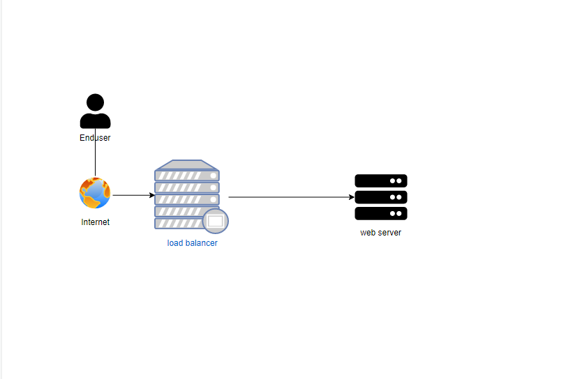
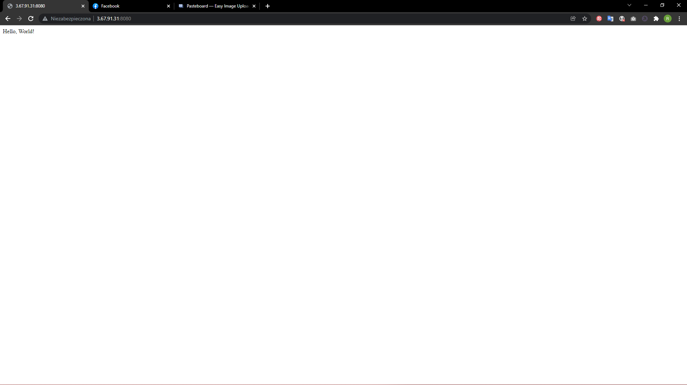

### Instalacja aplikacji 

- Instalacja python'a  i git'a 
- Pobranie repozytorium 
- Stworzenie użytkownika i nadanie uprawnień
- Stworzenie virtual environment
- Instalacja dependencies
- Zarejestrowanie jako seris
- Wystartowanie serwisu

### Konfiguracja proxy
- Instalacja epel
- Intalacja nginx
- Przekopiowanie konfiguracji load balancer'a 
- Restart nginx

## Diagram 

## App

